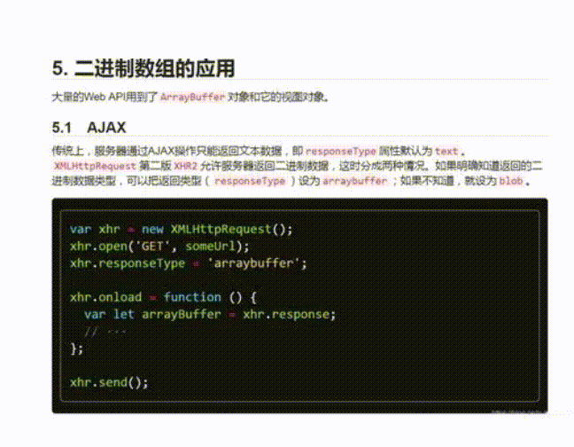

# Ti-Zoom
- This component library provides a zoom effect plugin to help users view details clearly.

- The zoom effect plugin in this component library offers a high-quality and highly customizable experience for viewing details.

## 中文描述
- 该组件库提供放大镜效果的插件，帮助用户清晰查看细节。
- 该组件库的放大镜效果插件提供了高质量、高可定制性的细节查看体验。

## Demo
[Demo](https://github.com/Timtance/ti-zoom-test/tree/main/demo/index.html)




### install
```
npm install ti-zoom
// or
yarn add ti-zoom
```

### 在 Vue 2.x 中使用示例：
```bash
<template>
  <div>
    
  </div>
</template>

<script>
import 'ti-zoom/lib/ti-zoom.umd.js'; // 导入 ti-zoom 库

export default {
  data() {
    return {
      imageSrc: 'path/to/your/image.jpg',
    };
  },
  mounted() {
    // 在组件挂载后，初始化 ti-zoom
    // this.$refs.zoomImage 是 img 元素的引用
      setTimeout(() => {
        var t = new window.tuiZoom();
        t.setTarget(this.$refs.zoomImage);
      }, 1);
  },
};
</script>
```

### 在 Vue 3.x 中使用示例：
```bash
<template>
  <div>
    
  </div>
</template>

<script>
import { ref, onMounted } from 'vue';
import 'ti-zoom/lib/ti-zoom.umd.js'; // 导入 ti-zoom 库

export default {
  setup() {
    const zoomImage = ref(null);

    onMounted(() => {
      // 在组件挂载后，初始化 ti-zoom
      // zoomImage.value 是 img 元素的引用
      setTimeout(() => {
        var t = new window.tuiZoom();
        t.setTarget(zoomImage.value);
      }, 1);
    });

    return {
      zoomImage
    };
  },
};
</script>
```

### 在 React 中使用示例：
```bash
import { useRef, useEffect } from 'react';
import 'ti-zoom/lib/ti-zoom.umd.js'; // 导入 ti-zoom 库

function ZoomImage(props) {
  const zoomImageRef = useRef(null);
  const imageSrc = props.imageSrc;

  useEffect(() => {
    // 在组件挂载后，初始化 ti-zoom
    // zoomImageRef.current 是 img 元素的引用
      setTimeout(() => {
        var t = new window.tuiZoom();
        t.setTarget(zoomImageRef.current);
      }, 1);
  }, []);

  return (
    <div>
      
    </div>
  );
}

export default ZoomImage;
```

### 在 原生 JavaScript 中使用示例：
```bash
<!DOCTYPE html>
<html>
  <head>
    <title>ti-zoom Demo</title>
  </head>
  <body>
    <div>
      
    </div>

    <script src="path/to/ti-zoom.js"></script>
    <script>
      // 在页面加载后，初始化 ti-zoom
      setTimeout(() => {
        const zoomImage = document.getElementById('zoomImage');
        var tuiZoom = new tuiZoom("zoomImage")
        tuiZoom.setTarget(zoomImage)
      })
    </script>
  </body>
</html>
```

## TiZoom

- TiZoom Readme.md [Chinese](https://github.com/Timtance) | [English](https://github.com/Timtance)

## TiZoom Logs
- 1.1.0 add zoom Module and inner functions to moving object
- 1.2.0 add public function ["setBoxObjZoom", "setTarget", "setZoomRate", "destroy", "setZoomStyle"]


### Recommended IDE Setup

- [VS Code](https://code.visualstudio.com/)

### Build a process for submitting npm projects
- cd project's name file
- npm init
- npm install --save-dev @babel/core@7.16.7 @babel/preset-env@7.16.5 @rollup/plugin-babel@5.3.0 rollup@2.79.1 rollup-plugin-terser@7.0.2
- "build": "rollup -c" ( configure package.json )
- rollup.config.js ( Create rollup configuration file )

### Follow


## MIT LICENSE
Permission is hereby granted, free of charge, to any person obtaining
a copy of this software and associated documentation files (the
"Software"), to deal in the Software without restriction, including
without limitation the rights to use, copy, modify, merge, publish,
distribute, sublicense, and/or sell copies of the Software, and to
permit persons to whom the Software is furnished to do so, subject to
the following conditions:

The above copyright notice and this permission notice shall be
included in all copies or substantial portions of the Software.

THE SOFTWARE IS PROVIDED "AS IS", WITHOUT WARRANTY OF ANY KIND,
EXPRESS OR IMPLIED, INCLUDING BUT NOT LIMITED TO THE WARRANTIES OF
MERCHANTABILITY, FITNESS FOR A PARTICULAR PURPOSE AND
NONINFRINGEMENT. IN NO EVENT SHALL THE AUTHORS OR COPYRIGHT HOLDERS BE
LIABLE FOR ANY CLAIM, DAMAGES OR OTHER LIABILITY, WHETHER IN AN ACTION
OF CONTRACT, TORT OR OTHERWISE, ARISING FROM, OUT OF OR IN CONNECTION
WITH THE SOFTWARE OR THE USE OR OTHER DEALINGS IN THE SOFTWARE.